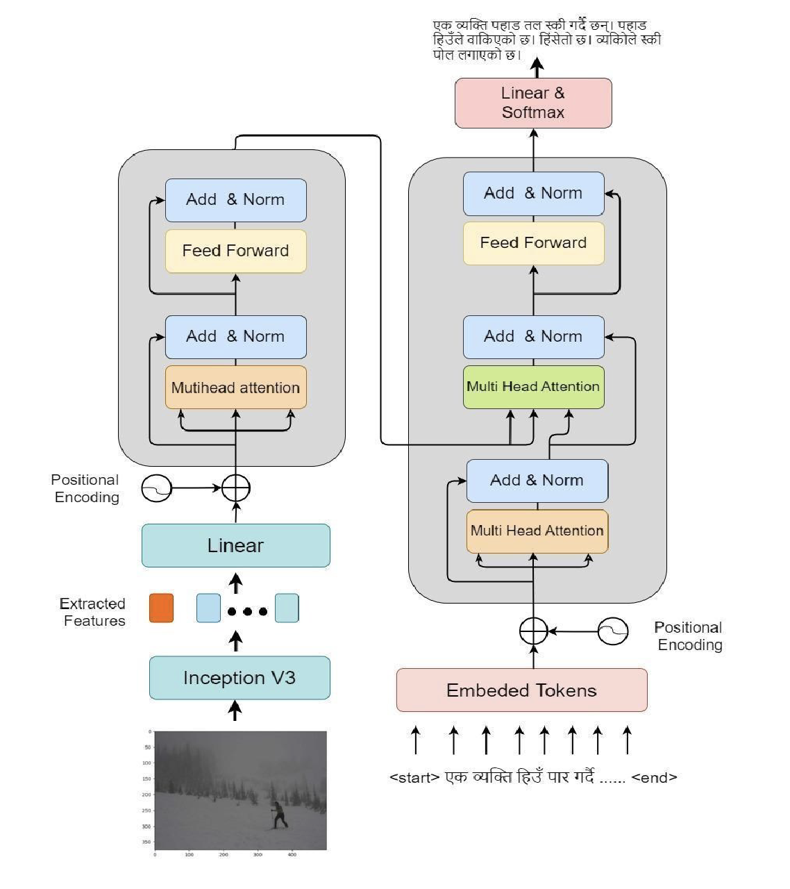
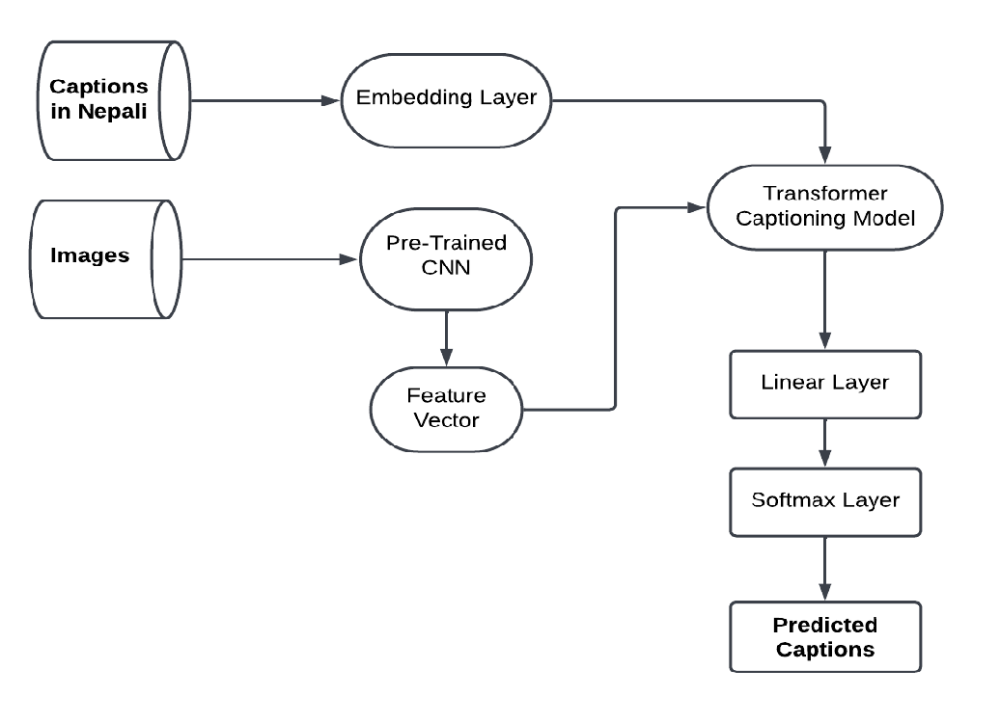
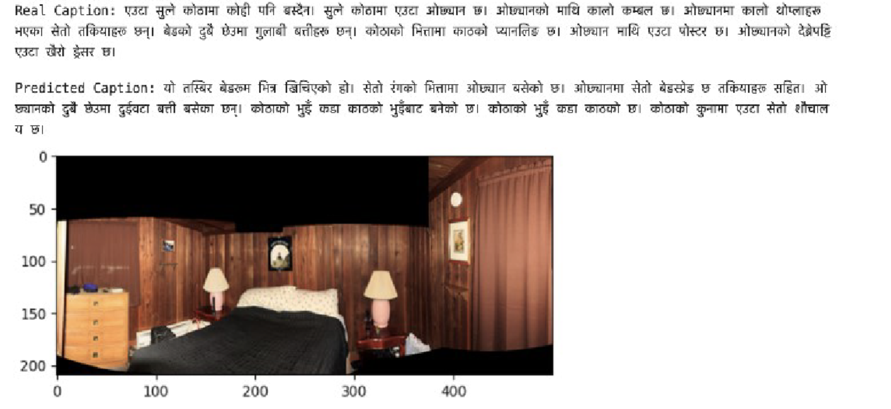
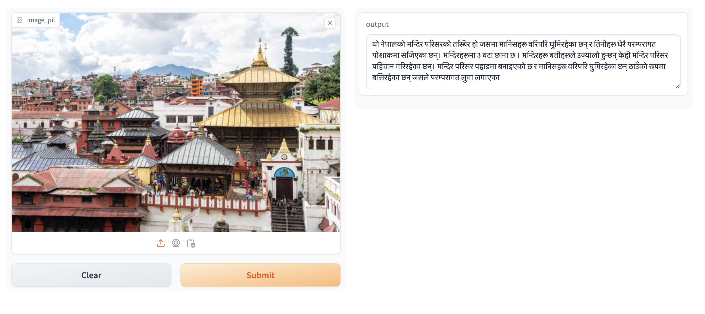
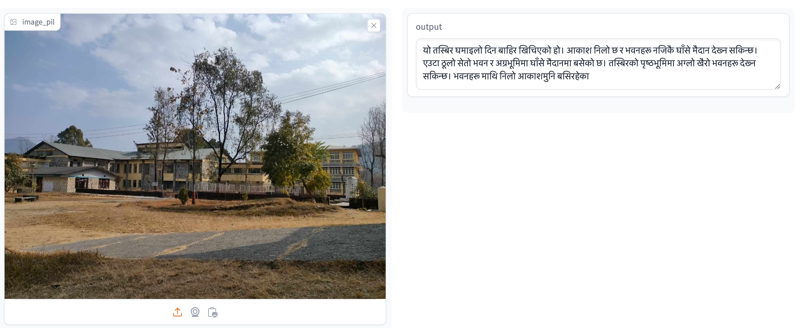

## **Introduction: Bridging the Gap with Nepali Language Image Captioning**

In a world where visual media reigns supreme, the ability to describe images in natural language is a crucial skill for technology. From assisting the visually impaired to enhancing tourism and urban development, image captioning offers endless possibilities. While considerable progress has been made in English, languages like Nepali remain largely unexplored. This blog delves into a groundbreaking research effort to fill this gap by generating coherent paragraph-length Nepali captions using a combination of deep learning techniques.

---

## **Challenges of Image Captioning in Nepali**

Nepali presents unique challenges when it comes to image captioning. Its grammatical complexity and the limited availability of natural language processing (NLP) resources make it a difficult language to work with. Previous work in image captioning, especially in Nepali, has been limited to generating single sentences, which fails to capture the full context of an image. Our research aimed to change that by generating paragraph-long, coherent descriptions, mimicking human-like narratives.

---

## **The Model: A Transformer-CNN Hybrid**

At the heart of our approach is the **Transformer** architecture, combined with a **Convolutional Neural Network (CNN)** for feature extraction. Specifically, we used the **InceptionV3** model to extract image features, which were then passed to the encoder segment of the Transformer. Meanwhile, the decoder processed embedded tokens from Nepali captions.

<div style="display: flex; flex-direction: column; align-items: center;">

<p style="text-align: center;">Fig 1. Transformer Architecture for Image Captioning</p>
</div>

This setup allowed us to generate captions that were not just simple sentences but coherent, context-rich paragraphs, reflecting the intricacies of the Nepali language.

---

## **Dataset Collection: A Blend of Culture and Technology**

To train our model, we used a combination of datasets:

1. **Stanford Paragraph Captioning Dataset**: This English dataset was translated into Nepali using the Google Translate API. While this provided a strong base, Google Translate often struggled with Nepali’s grammar, so we manually corrected the translated captions.
2. **Cultural Heritage Dataset**: We curated 800 images of Nepal's cultural heritage, each accompanied by manually written Nepali captions. This dataset brought in the richness and diversity of Nepali culture, making the model more attuned to local contexts.

Together, these datasets created a unique blend of technological advancement and cultural richness, providing the model with a wealth of data to learn from.

---

## **Methodology: How It All Works**

Our approach involved several key steps:

1. **Feature Extraction**: The InceptionV3 model was used to extract the key features from images.
2. **Tokenization**: The Nepali captions were tokenized, embedding each word into a form the model could understand.
3. **Encoding and Decoding**: The encoded image features and tokenized captions were processed by the Transformer’s encoder-decoder architecture.
4. **Training**: The model was trained on our curated dataset, using metrics like BLEU scores to evaluate its performance.

<div style="display: flex; flex-direction: column; align-items: center;">

<p style="text-align: center;">Fig 2. The Methodology</p>
</div>

---

## **Key Metrics and Results: Measuring Success**

To evaluate the effectiveness of our model, we used **BLEU scores**, a widely recognized metric in natural language processing. Here are the results:

| **Metric** | **Score** |
| ---------- | --------- |
| BLEU-1     | 0.23      |
| BLEU-2     | 0.35      |
| BLEU-3     | 0.53      |
| BLEU-4     | 0.59      |

The high BLEU-4 score of **0.59** indicates that our model was able to generate accurate and coherent descriptions for images, a significant improvement over previous single-sentence models.

<div style="display: flex; flex-direction: column; align-items: center;">

<p style="text-align: center;">Fig 3. A Sample Caption Generated by the Model</p>
</div>

---

## **Sample Captions: Bringing It All Together**

Let’s take a look at some of the sample captions generated by our model. These examples showcase how the model interprets various elements of an image—objects, relationships, and actions—and generates a coherent, context-rich Nepali description.

1. **Sample 1**: A depiction of a traditional Nepali festival with people in cultural attire.
<div style="display: flex; flex-direction: column; align-items: center;">

<p style="text-align: center;">Fig 4. Sample Caption 1 </p>
</div>

2. **Sample 2**: A photograph of a famous Nepali landmark, accompanied by a detailed description of its historical significance.

<div style="display: flex; flex-direction: column; align-items: center;">

<p style="text-align: center;">Fig 5. Sample  Caption 2</p>
</div>

---

## **Implementation: The Code Behind the Magic**

For those interested in the technical details, here’s a simplified version of the code used to implement the Transformer-based image captioning model:

```python
from transformers import VisionEncoderDecoderModel, ViTFeatureExtractor, GPT2Tokenizer

# Load pre-trained Inception model for feature extraction
model = VisionEncoderDecoderModel.from_pretrained("nlp_inception_v3")
feature_extractor = ViTFeatureExtractor.from_pretrained("google/vit-base-patch16-224")

# Load tokenizer for Nepali captions
tokenizer = GPT2Tokenizer.from_pretrained("nepali_gpt")

# Encode image and tokenize caption
inputs = feature_extractor(images=image, return_tensors="pt")
caption = tokenizer(caption_text, return_tensors="pt")

# Forward pass through encoder-decoder
outputs = model.generate(inputs, max_length=50)

# Decode output tokens
generated_caption = tokenizer.decode(outputs[0], skip_special_tokens=True)
print(generated_caption)
```

This code demonstrates how we extracted features from an image, tokenized Nepali captions, and passed the data through our model to generate a paragraph-length description.

---

## **Conclusion: A New Frontier in Nepali Image Captioning**

This research marks a significant step forward in image captioning for the Nepali language. By leveraging the power of Transformer models, we have created a system capable of generating coherent, human-like paragraphs that describe images in rich detail. The implications of this technology are vast, from making digital content more accessible to enhancing the tourism experience in Nepal.

As we continue to improve this model, we envision it becoming a key tool in applications that require the interpretation and generation of natural language descriptions in Nepali. The future of multilingual image captioning is bright, and we’re excited to be at the forefront of this movement.

---

## **References**

1. [Krause, J., Johnson, J., Krishna, R., Fei-Fei, L. (2017)](https://openaccess.thecvf.com/content_cvpr_2017/papers/Krause_A_Hierarchical_Approach_CVPR_2017_paper.pdf). "A hierarchical approach for generating descriptive image paragraphs." In IEEE Conference on Computer Vision and Pattern Recognition.
2. [Vaswani, A., et al. (2017)](https://arxiv.org/abs/1706.03762). "Attention is all you need." Advances in neural information processing systems 30.
3. [Subedi, B., Bal, K.B. (2022)](https://aclanthology.org/2022.icon-main.12/). "CNN-Transformer based Encoder-Decoder Model for Nepali Image Captioning." In Proceedings of the 19th International Conference on Natural Language Processing.
4. [Adhikari, A., Ghimire, S. (2019)](https://ieeexplore.ieee.org/document/8947436). "Nepali Image Captioning." In IEEE Artificial Intelligence for Transforming Business and Society.
5. [Budhathoki, R., Timilsina, S. (2023)](https://doi.org/10.3126/jes2.v2i1.60391). "Image Captioning in Nepali Using CNN and Transformer Decoder."

---
