## **Introduction**

In today's digital landscape, building applications that can gracefully handle increasing user demands isn't just a nice-to-have—it's essential for business success. Just as a well-designed bridge must withstand varying traffic loads while maintaining its structural integrity, modern applications need robust architecture that can scale seamlessly with growing user demands.

Building a scalable Node.js application is analogous to constructing a sturdy, flexible bridge. Just as a bridge needs solid foundations and seamless paths to handle increasing traffic, your application requires a robust architecture and smooth deployment pipelines to support growing user demands.

In this comprehensive guide, we'll leverage AWS EKS (Elastic Kubernetes Service) to provide the structure, and implement a CI/CD pipeline to ensure smooth, automated updates, enabling your Node.js application to scale effortlessly as traffic increases.

## **Architecture Overview**

Our solution implements a modern, cloud-native architecture utilizing the following components:

🔧 **Core Components**

- **Application Runtime**: Node.js with Express
- **Containerization**: Docker
- **Container Orchestration**: AWS EKS (Kubernetes)
- **Database**: MongoDB
- **Object Storage**: AWS S3

🚀 **DevOps Tools**

- **Container Registry**: Amazon ECR
- **CI/CD Pipeline**: AWS CodePipeline
- **Load Balancing**: AWS Application Load Balancer (ALB)
- **Monitoring**: Amazon CloudWatch

<div style="display: flex; flex-direction: column; align-items: center;">
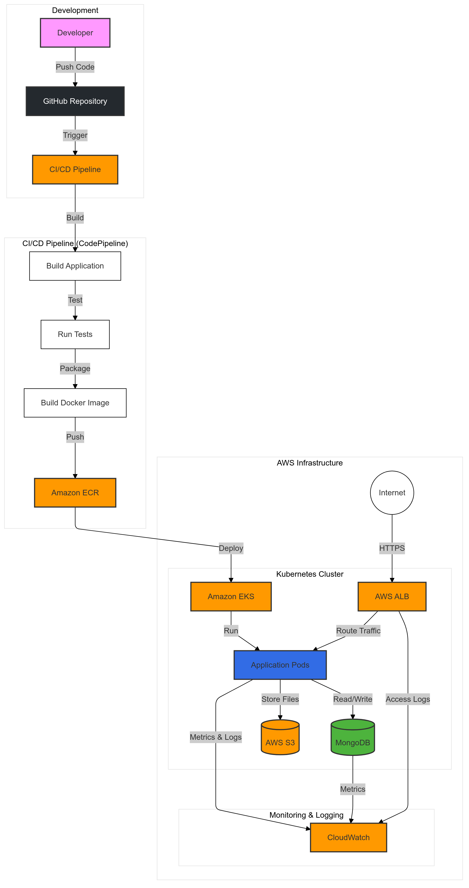
<p style="text-align: center;">Fig 1. Architecture Diagram</p>
</div>

## **Project Setup**

Let's begin by establishing our Node.js application using Express. I have created a project that integrates essential AWS services including S3 bucket, MongoDB, and other critical components. You can access the complete project at [Github link](https://github.com/chhetri123/scale_api).

The project follows this structured organization:

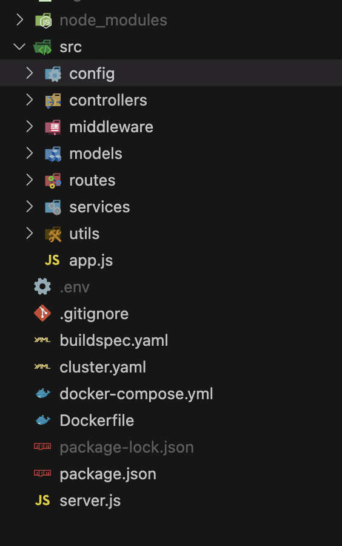

<p style="text-align: center;">Fig 2. Folder Structure</p>

> 💡 **Note**: Don't concern yourself with the Docker file and other folders like k8s at this stage. We will systematically create these in subsequent steps.

## **Docker Configuration**

Docker serves as a containerization platform for your application, effectively packaging all necessary dependencies to ensure consistent execution across any environment. This containerization ensures your Node.js application maintains reliability from development through to production, eliminating concerns about dependency conflicts or configuration discrepancies.

Let's create our Dockerfile in the root directory:

_Dockerfile_

```yaml
FROM node:18-alpine

WORKDIR /usr/src/app

COPY package*.json ./
RUN npm install

COPY . .

EXPOSE 8080

CMD ["npm", "start"]
```

Port 8080 has been specified to maintain consistency across both local development and Kubernetes environments.

## **ECR : Elastic Container Registry**

ECR functions as a secure repository for your Docker images, ensuring they're stored safely and remain readily accessible by your Kubernetes cluster.

To utilize ECR, you must first establish an AWS account and create an ECR repository.

Step 1: **Initialize your ECR repository**

<div style="display: flex; flex-direction: column; align-items: center;">
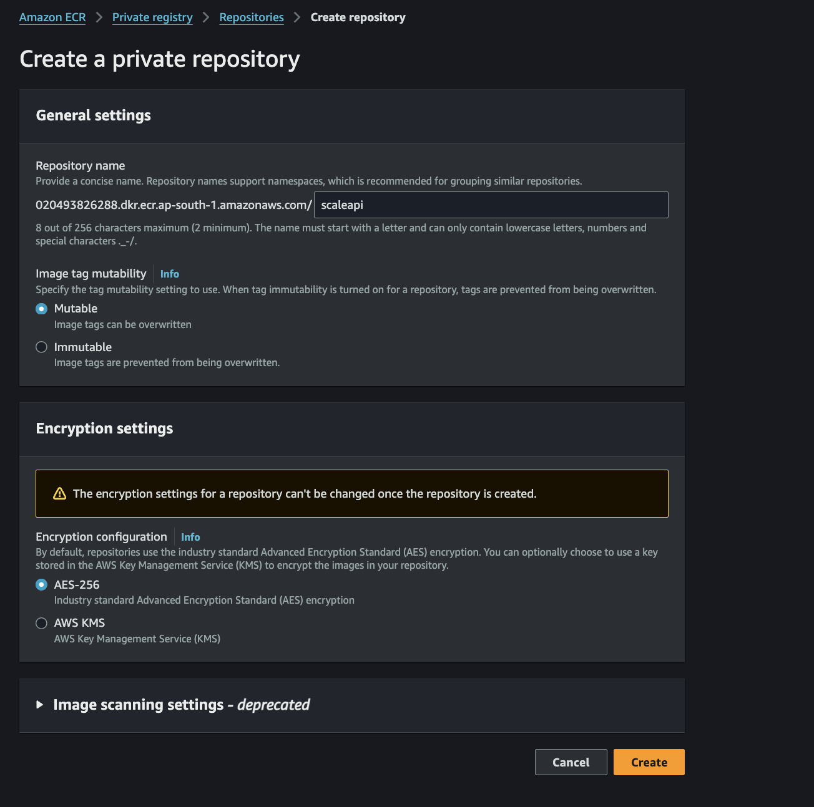
<p style="text-align: center;">Fig 3. ECR Initialization</p>
</div>

Click the create button to establish a repository named "scaleapi". You have the flexibility to choose any appropriate name for your repository.

Step 2: **Upon creation, your repository will appear in the repository list.**

<div style="display: flex; flex-direction: column; align-items: center;">
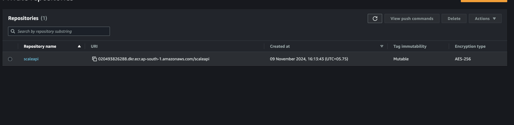
<p style="text-align: center;">Fig 4. ECR Repository List</p>
</div>

Step 3: **Select your repository named "scaleapi" and access the "view push commands" option.**

<div style="display: flex; flex-direction: column; align-items: center;">
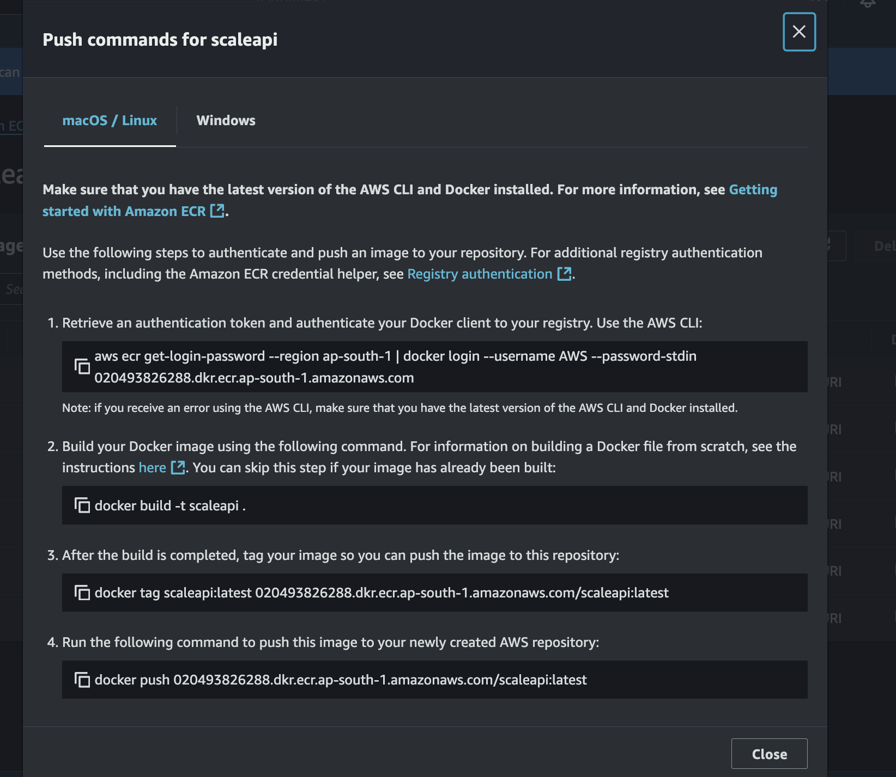
<p style="text-align: center;">Fig 5. ECR Push Commands</p>
</div>

To automate the image management process, we'll implement a buildspec.yaml file in the root directory. This file orchestrates the Docker image deployment to the ECR repository, handling local image building, pushing to ECR, and managing image tags.

Create a `buildspec.yaml` to automate your Docker image deployments:

```yaml
version: 0.2

phases:
  pre_build:
    commands:
      - aws ecr get-login-password --region ap-south-1 | docker login --username AWS --password-stdin 020493826288.dkr.ecr.ap-south-1.amazonaws.com
  build:
    commands:
      - docker build -t scaleapi .
      - docker tag scaleapi:latest 020493826288.dkr.ecr.ap-south-1.amazonaws.com/scaleapi:latest
  post_build:
    commands:
      - docker push 020493826288.dkr.ecr.ap-south-1.amazonaws.com/scaleapi:latest
```

After configuring these files, commit and push your code to the GitHub repository.

## **CodePipeline: Continuous Integration and Continuous Deployment**

CodePipeline operates as an orchestrator for your CI/CD pipeline, ensuring seamless execution of each step while providing clear visibility into any issues. Through CodePipeline, you can automate your build, test, and deployment processes, preparing your Node.js application for efficient scaling as demand grows.

Navigate to the AWS console and access the CodePipeline service. Initiate the pipeline creation process.

Step 1:
Select the "Build custom pipeline" option.

Step 2:

- Assign the pipeline name "scaleapi-pipeline"
- For the service role, you may utilize an existing role or generate a new one

Your configuration should resemble:

<div style="display: flex; flex-direction: column; align-items: center;">
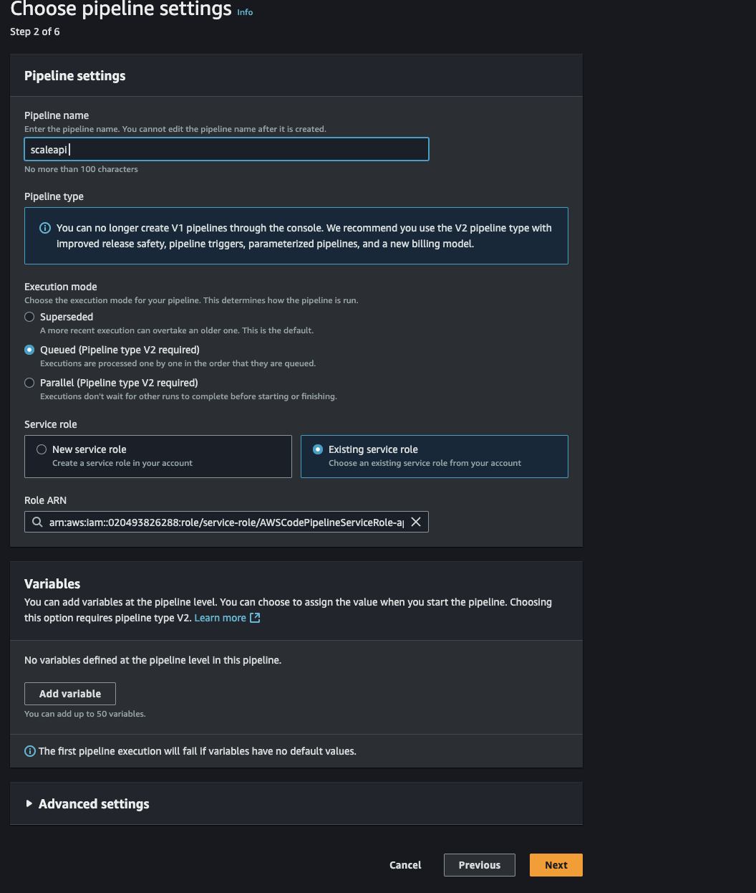
<p style="text-align: center;">Fig 6. CodePipeline Configuration</p>
</div>

Step 3:
Configure GitHub as your source provider through the GitHub app:

- Initiate GitHub connection via the "Connect to GitHub" button
- Select your account and proceed with "Install and Authorize"
- Select your repository "scale_api"
- Proceed to the next step
- Specify "main" as your branch name in the include field
- Continue to the next section

Your configuration should appear as:

<div style="display: flex; flex-direction: column; align-items: center;">
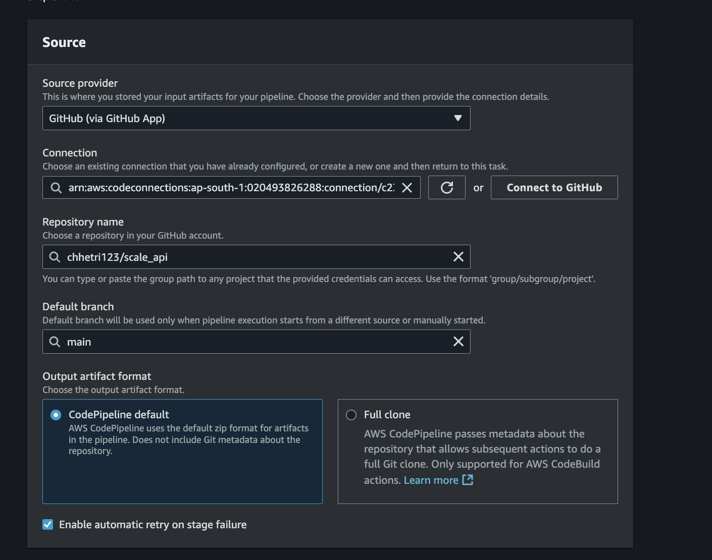
<p style="text-align: center;">Fig 7. GitHub Source Configuration</p>
</div>

<div style="display: flex; flex-direction: column; align-items: center;">
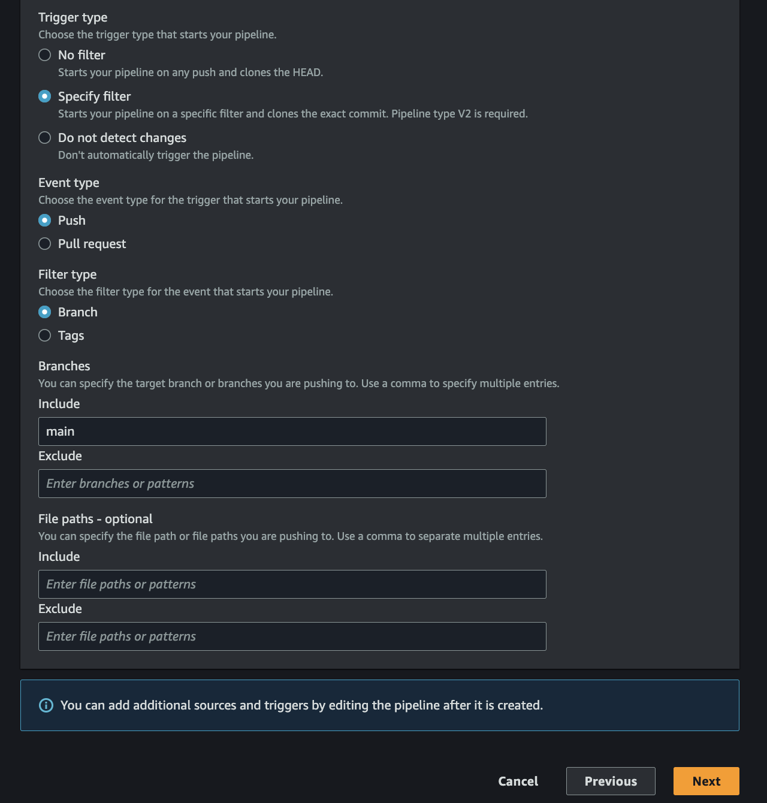
<p style="text-align: center;">Fig 8. GitHub Branch Selection</p>
</div>

Step 4:
In the build stage configuration:
Select "AWS CodeBuild" as your build provider and name your project "scaleapi-build".
Proceed to the next step.

Step 5:
Bypass the deploy stage by selecting "Skip deploy stage".

Step 6:
Finalize the pipeline by clicking "Create pipeline".

Your pipeline will now appear in the pipeline list.

<div style="display: flex; flex-direction: column; align-items: center;">
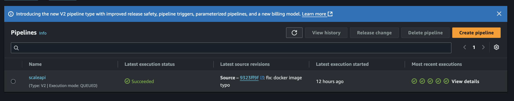
<p style="text-align: center;">Fig 9. Pipeline List</p>
</div>

Selecting your pipeline "scaleapi-pipeline" reveals the pipeline's operational status.

<div style="display: flex; flex-direction: column; align-items: center;">
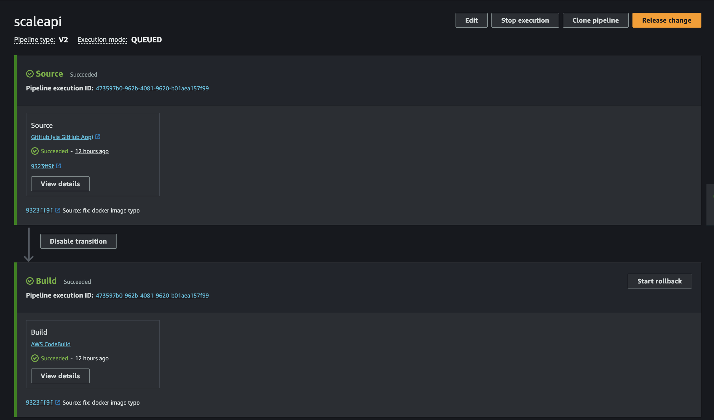
<p style="text-align: center;">Fig 10. Pipeline Status</p>
</div>

Within the build stage, you can monitor the build status.

If you encounter a GetAuthorizationToken failed: Unauthorized error, resolve it by:

- Navigating to `IAM/roles/`
- Selecting the CodeBuild service role
- Accessing `Add permissions`
- Selecting `Attach policy`
- Searching for and attaching the `AmazonEC2ContainerRegistryPowerUser` policy

Return to your pipeline and trigger a new release to verify the successful build completion.

## **Kubernetes Configuration : Deploying the Application**

Kubernetes functions as an orchestrator for your application, managing and coordinating containers to ensure optimal performance and efficient scaling. It automates deployment, scaling, and operational tasks, maintaining your Node.js application's reliability even under increasing demands.

This implementation requires the installation of 'kubectl', 'aws cli', and "eksctl" on your local environment.

### **Prerequisites Installation**

1. **Install AWS CLI**

```bash
# For macOS (using Homebrew)
brew install awscli
```

2. **Install kubectl**

```bash
# For macOS (using Homebrew)
brew install kubectl
```

3. **Install eksctl**

```bash
# For macOS (using Homebrew)
brew tap weaveworks/tap
brew install weaveworks/tap/eksctl
```

Verify your installations:

```bash
aws --version
kubectl version --client
eksctl version
```

Step 1:
Create your EKS cluster by first establishing a cluster.yaml file containing:

_cluster.yaml_

```yaml
apiVersion: eksctl.io/v1alpha5
kind: ClusterConfig

metadata:
  name: scaleapi-node
  region: ap-south-1

nodeGroups:
  - name: ng-1
    instanceType: m5.large
    desiredCapacity: 3
    # will use ~/.ssh/id_rsa.pub as the default ssh key
```

Customize the instance type and capacity according to your requirements.

Step 2:
Execute the cluster creation from your root directory:

```bash
eksctl create cluster -f cluster.yaml
```

This process typically requires 10-15 minutes for completion.

Step 3:
Verify your cluster creation:

<div style="display: flex; flex-direction: column; align-items: center;">
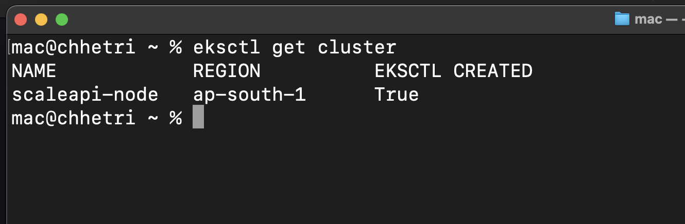
<p style="text-align: center;">Fig 11. EKS Cluster Verification</p>
</div>

Your cluster should now contain three nodes:

<div style="display: flex; flex-direction: column; align-items: center;">
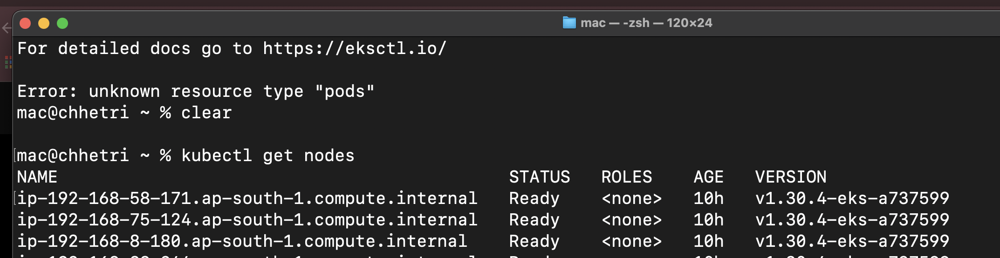
<p style="text-align: center;">Fig 12. EKS Node Details</p>
</div>

## **Helm Chart**

Helm charts serve as blueprints for deploying applications on Kubernetes, providing a structured approach to define, install, and manage applications at scale. This package manager simplifies complex Kubernetes deployments by consolidating all necessary resources and configurations into a single, reusable chart.

Install Helm using:

```bash
brew install helm
```

Navigate to your k8s directory and execute:

```bash
helm install scaleapi .
```

Clear the templates directory and values.yaml file contents.

Step 3:
For environment variable management, create Kubernetes secrets:

```bash
 kubectl create secret generic aws-secrets \
   --from-literal=AWS_ACCESS_KEY_ID='your aws access key id' \
   --from-literal=AWS_SECRET_ACCESS_KEY='your aws secret access key' \
   --from-literal=AWS_REGION='your aws region' \
  --from-literal=AWS_S3_BUCKET='your aws s3 bucket'
```

```bash
 kubectl create secret generic api-secrets \
  --from-literal=MONGODB_URI='your mongodb uri'
```

Verify secret creation:

```bash
kubectl get secrets
```

Step 4:
Create deployment.yaml in your templates directory:

_deployment.yaml_

```yaml
apiVersion: apps/v1
kind: Deployment
metadata:
  labels:
    app: scaleapi
  name: scaleapi
spec:
  replicas: 1
  selector:
    matchLabels:
      app: scaleapi
  template:
    metadata:
      labels:
        app: scaleapi
    spec:
      containers:
        - image: 020493826288.dkr.ecr.ap-south-1.amazonaws.com/scaleapi
          ports:
            - containerPort: 8080
          env:
            - name: AWS_ACCESS_KEY_ID
              valueFrom:
                secretKeyRef:
                  name: aws-secrets
                  key: AWS_ACCESS_KEY_ID
            - name: AWS_SECRET_ACCESS_KEY
              valueFrom:
                secretKeyRef:
                  name: aws-secrets
                  key: AWS_SECRET_ACCESS_KEY
            - name: AWS_REGION
              valueFrom:
                secretKeyRef:
                  name: aws-secrets
                  key: AWS_REGION
            - name: AWS_S3_BUCKET
              valueFrom:
                secretKeyRef:
                  name: aws-secrets
                  key: AWS_S3_BUCKET
            - name: MONGODB_URI
              valueFrom:
                secretKeyRef:
                  name: api-secrets
                  key: MONGODB_URI
            - name: PORT
              value: "8080"
```

Step 5:
Apply your changes:

```bash
helm upgrade scaleapi .
```

Monitor your deployment:

```bash
kubectl get deployments
kubectl get pods
kubectl logs <pod-name>
```

Example output:

<div style="display: flex; flex-direction: column; align-items: center;">
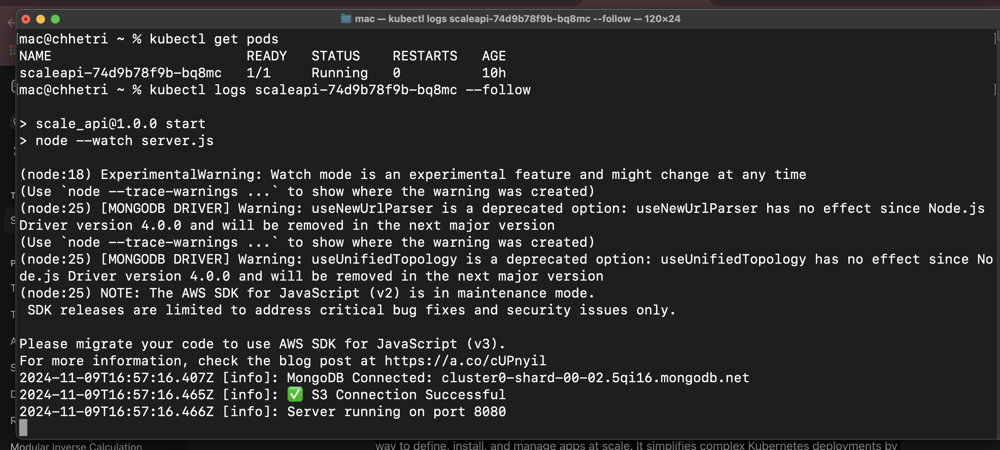
<p style="text-align: center;">Fig 13. Deployment Logs</p>
</div>

Your Node.js Application is now deployed with AWS EKS and CI/CD Pipeline.

To enable external access, implement a LoadBalancer.

## **LoadBalancer ( Ingress )**

A LoadBalancer (Ingress) directs external traffic to your Kubernetes applications, efficiently routing requests to appropriate services within the cluster. This ensures your Node.js application remains accessible and scalable.

Step 1:
Install the Load Balancer Controller following the [official documentation](https://kubernetes-sigs.github.io/aws-load-balancer-controller/latest/deploy/installation/) or execute:

```bash
eksctl utils associate-iam-oidc-provider \
  --region ap-south-1 \
  --cluster scaleapi-node \
  --approve

curl -o iam-policy.json https://raw.githubusercontent.com/kubernetes-sigs/aws-load-balancer-controller/v2.10.0/docs/install/iam_policy.json

aws iam create-policy \
  --policy-name AWSLoadBalancerControllerIAMPolicy \
  --policy-document file://iam-policy.json

eksctl create iamserviceaccount \
--cluster=scaleapi-node \
--namespace=kube-system \
--name=aws-load-balancer-controller \
--attach-policy-arn=arn:aws:iam::<your-account-id>:policy/AWSLoadBalancerControllerIAMPolicy \
--override-existing-serviceaccounts \
--region ap-south-1 \
--approve

wget https://raw.githubusercontent.com/aws/eks-charts/master/stable/aws-load-balancer-controller/crds/crds.yaml

kubectl apply -f crds.yaml

helm install aws-load-balancer-controller eks/aws-load-balancer-controller -n kube-system --set clusterName=scaleapi-node --set serviceAccount.create=false --set serviceAccount.name=aws-load-balancer-controller
```

Remove iam-policy.json after successful installation.

Verify LoadBalancer status:

```bash
kubectl get pods -n kube-system
```

Expected output:

<div style="display: flex; flex-direction: column; align-items: center;">
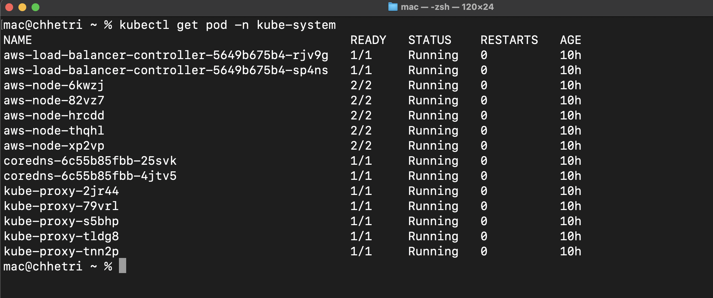
<p style="text-align: center;">Fig 14. LoadBalancer Pods</p>
</div>

<div style="display: flex; flex-direction: column; align-items: center;">
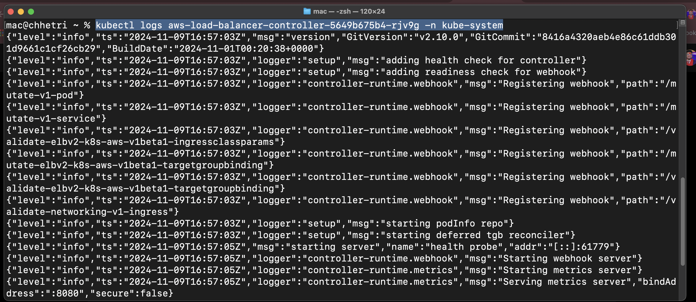
<p style="text-align: center;">Fig 15. LoadBalancer Status</p>
</div>

Step 3:
Create ingress.yaml in your templates directory:

_ingress.yaml_

```yaml
apiVersion: networking.k8s.io/v1
kind: Ingress
metadata:
  name: scaleapi-ingress
  annotations:
    alb.ingress.kubernetes.io/scheme: internet-facing
    alb.ingress.kubernetes.io/target-type: ip
spec:
  ingressClassName: alb
  rules:
    - http:
        paths:
          - path: /
            pathType: Prefix
            backend:
              service:
                name: scaleapi
                port:
                  number: 8080
```

Step 4:
Apply your changes:

```bash
helm upgrade scaleapi .
```

Verify ingress creation:

```bash
kubectl get ingress
```

Your application should now have a provisioned address:

<div style="display: flex; flex-direction: column; align-items: center;">
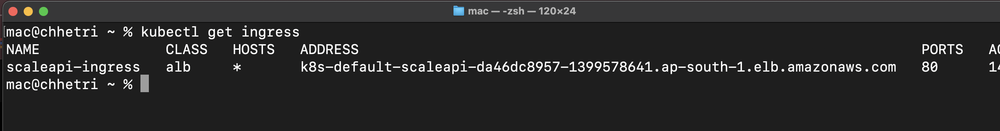
<p style="text-align: center;">Fig 16. Ingress Address</p>
</div>

Access your application through this address:

<div style="display: flex; flex-direction: column; align-items: center;">
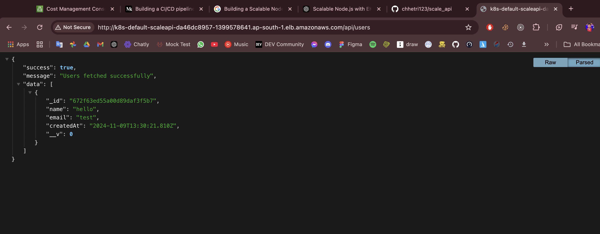
<p style="text-align: center;">Fig 17. Application Access</p>
</div>

In AWS services:

- Navigate to EC2 dashboard
- Access Load Balancer section
- Select scaleapi-ingress
- Review LoadBalancer details
  <div style="display: flex; flex-direction: column; align-items: center;">
  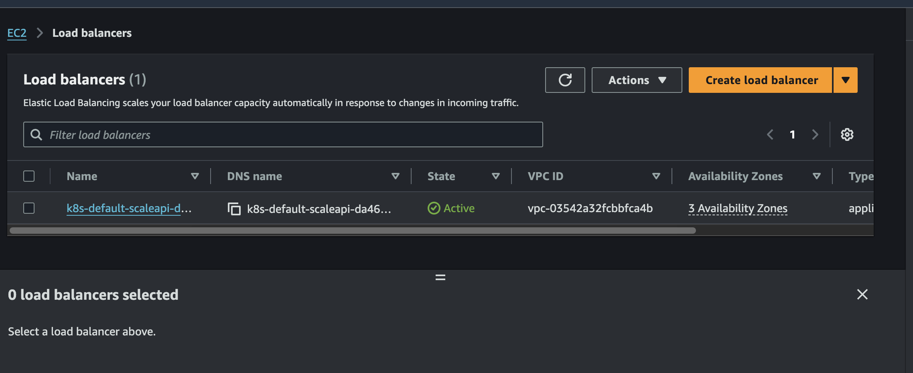
  <p style="text-align: center;">Fig 18. LoadBalancer Details</p>
  </div>

Monitor other services similarly. The infrastructure will automatically scale services as traffic increases.

## **Conclusion**

This guide has demonstrated the complete process of building a scalable Node.js application using AWS EKS and CI/CD Pipeline. We've implemented essential AWS services including ECR, CodePipeline, EKS, LoadBalancer, and MongoDB. The guide covered deployment using Helm charts and establishing ingress for external access. This architecture ensures your application can scale efficiently while maintaining reliability and performance.

## **References**

- [AWS EKS](https://aws.amazon.com/eks/)
- [AWS ECR](https://aws.amazon.com/ecr/)
- [AWS CodePipeline](https://aws.amazon.com/codepipeline/)
- [AWS LoadBalancer](https://kubernetes-sigs.github.io/aws-load-balancer-controller/latest/)
