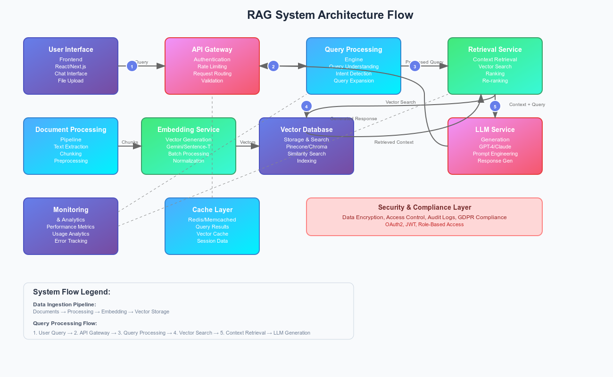

## **Introduction: The AI Knowledge Revolution**

In today’s rapidly evolving world of artificial intelligence, organizations face a challenge that goes beyond just adopting AI – it’s about **making AI truly useful in a business context**. How can companies ensure that AI provides accurate, secure, and business-relevant answers instead of generic or misleading responses?

This isn’t simply a technical problem; it’s a **strategic challenge**. Businesses need systems that are not only powerful but also **trustworthy, transparent, and secure**.

That’s where **RAG (Retrieval-Augmented Generation)** steps in.

Think of RAG as a **supercharged assistant**:

- It doesn’t just rely on what it learned in the past.
- It can instantly search through your organization’s knowledge base.
- It provides **fact-based answers with sources**, ensuring that employees or customers trust its responses.

In short, RAG bridges the gap between **AI’s potential** and **real-world business needs**.

---

## **Understanding RAG: Beyond Basic AI**

### **The Traditional AI Challenge**

Large Language Models (LLMs) like GPT are incredibly powerful. They’ve been trained on vast amounts of data and can generate human-like text. But they also come with **serious limitations** when used in enterprises:

1. **Knowledge Cutoff** – LLMs can’t learn new things after their last training date. For example, an LLM trained in 2023 won’t know about events in 2025 unless updated.
2. **Hallucinations** – Sometimes, AI generates answers that sound right but are completely wrong. Imagine an employee asking about company policies and getting a made-up response. That’s risky.
3. **Privacy Concerns** – Sending sensitive company documents to a public AI model is not acceptable for many organizations.
4. **No Source Verification** – LLMs can’t naturally say, _“This answer came from Document A, Section 3.”_

### The RAG Solution

RAG changes the game by implementing a **“read-then-respond”** workflow. Instead of just guessing, the AI **retrieves** relevant knowledge from your documents and **then generates** a response.

Here’s how it solves the above problems:

- **Real-time Knowledge Access** – RAG can pull in the latest company reports, product manuals, or policy documents.
- **Factual Grounding** – Every answer is backed by actual documents. For example, “According to the HR Policy Document, employees get 18 days of annual leave.”
- **Privacy Control** – All data stays within your own system, ensuring compliance.
- **Source Attribution** – Users can see exactly which documents were used, building trust.

---

## **System Architecture: Building for Scale**

A true enterprise-grade RAG system isn’t just about connecting an LLM to a database. It requires a **modular, microservices-based architecture** that can handle scale, reliability, and security.

<div style="display: flex; flex-direction: column; align-items: center;">

<p style="text-align: center;">Fig 1. RAG System Architecture</p>
</div>

Let’s walk through the **four main layers** of our implementation.

---

### **1. Document Processing Layer**

The first step in the journey is **preparing the knowledge base**. Raw documents (PDFs, Word files, text files) aren’t ready for AI. They need to be processed, cleaned, and broken into manageable chunks.

```javascript
class DocumentProcessor {
  async processDocument(file, userId, metadata = {}) {
    try {
      const documentId = uuidv4();
      const text = await this.extractText(file);

      // Intelligent chunking with context preservation
      const chunks = this.chunkText(text, {
        maxChunkSize: 1000,
        overlapSize: 200,
      });

      this.logger.info(`Document processed: ${chunks.length} chunks created`);

      return {
        documentId,
        chunks,
        metadata: {
          filename: file.originalname,
          mimetype: file.mimetype,
          processingDate: new Date(),
          chunkCount: chunks.length,
          ...metadata,
        },
      };
    } catch (error) {
      this.logger.error(`Processing failed: ${error.message}`);
      throw error;
    }
  }
}
```

Here’s what’s happening:

- **File Format Handling** – Whether it’s a PDF contract or a DOCX HR handbook, the system extracts text.
- **Chunking** – Documents are broken into **chunks of \~1000 characters** with **200-character overlaps** so context is not lost between sections.
- **Metadata Storage** – Information like filename, upload date, and owner is stored for traceability.
- **Error Handling** – Logs ensure failures can be debugged easily.

_Example_: If you upload a 50-page company policy document, instead of treating it as one massive block of text, it’s intelligently split into chunks that the AI can search quickly.

---

### **2. Vector Store: The Search Engine**

After processing, chunks are stored in a **Vector Database** (like Pinecone, Weaviate, or Milvus). This is what enables **semantic search** – instead of just keyword matching, it finds the **closest meaning**.

```javascript
class VectorStore {
  async query(vector, topK, filter, namespace) {
    return await this.implementRetryLogic(async () => {
      const results = await this.pinecone.query({
        vector,
        topK,
        filter,
        namespace,
        indexName: "rag-system",
      });

      return this.processResults(results.matches);
    }, "query");
  }

  processResults(matches) {
    return matches.map((match) => ({
      ...match,
      score: this.normalizeScore(match.score),
      metadata: this.enrichMetadata(match.metadata),
    }));
  }
}
```

Key points:

- **Vector Embeddings** – Each chunk is converted into a numerical representation in a high-dimensional space.
- **Similarity Search** – When you ask a question, your query is also turned into a vector. The system then finds the **closest chunks**.
- **Namespace Isolation** – Multi-tenant support ensures that one client’s data doesn’t mix with another’s.

_Example_: If you ask, _“What’s our refund policy?”_, the system retrieves the **most relevant passages** from the “Customer Policies” document, even if the exact word _“refund”_ isn’t mentioned (e.g., it may match with _“returns”_).

---

### **3. Generation Service: The Brain**

Once relevant chunks are retrieved, the **Generation Service** crafts the final response by combining the context with the user’s query.

```javascript
class GenerationService {
  async generateResponse(query, context, userId, stream = false) {
    const messages = this.constructPrompt(query, context);

    try {
      if (stream) {
        return await this.streamResponse(messages);
      }

      const response = await this.generateWithRetry(messages);
      await this.cacheManager.setGeneratedResponse(query, context, response);

      return response;
    } catch (error) {
      this.logger.error(`Generation failed: ${error.message}`);
      throw error;
    }
  }

  constructPrompt(query, context) {
    return [
      {
        role: "system",
        content: `
You are an expert AI assistant. Help users by answering questions using only the provided context.
Key guidelines:
- Use only information from the context
- If information is missing, acknowledge it
- Be concise and clear
- Cite specific sources when relevant
- Maintain a professional tone
        `.trim(),
      },
      {
        role: "user",
        content: `Context:\n${context}\n\nQuestion:\n${query}\n\nAnswer:`,
      },
    ];
  }
}
```

Here’s the flow:

- **Prompt Engineering** – The system ensures the AI only uses provided context.
- **Retry Logic** – If the LLM call fails, the system retries gracefully.
- **Caching** – Repeated queries (like “What’s the holiday policy?”) are cached to save cost and speed up responses.

_Example_: If you ask, _“How many annual leave days do employees get?”_, the AI will answer:

> “According to the HR Policy Document (Section 2.3), employees are entitled to **18 days of annual leave per year**.”

---

### **4. Caching Layer: Performance Optimization**

Caching ensures that **frequent queries** don’t hit the vector database or LLM repeatedly.

```javascript
class CacheManager {
  constructor() {
    this.client = redis.createClient({
      url: process.env.REDIS_URL,
    });

    this.client.on("error", (err) => this.logger.error("Redis Error:", err));

    this.client.connect();
  }

  async getEmbedding(text) {
    const key = `embedding:${this.hashText(text)}`;
    return this.get(key);
  }

  async setEmbedding(text, embedding) {
    const key = `embedding:${this.hashText(text)}`;
    await this.set(key, embedding, 604800); // 7 days
  }
}
```

Benefits:

- **Reduced Latency** – Answers appear faster for repeated queries.
- **Cost Efficiency** – Minimizes calls to expensive LLM APIs.
- **Scalability** – Handles spikes in user traffic without degrading performance.

_Example_: If hundreds of employees ask, _“When is the payroll processed?”_, the answer can be served instantly from cache.

---

## **Security Implementation**

Security is a non-negotiable requirement in enterprise systems.

```javascript
// Authentication Middleware
const authenticateToken = (req, res, next) => {
  try {
    const token = req.headers["authorization"]?.split(" ")[1];

    if (!token) {
      throw new Error("No token provided");
    }

    const decoded = jwt.verify(token, process.env.JWT_SECRET);
    req.user = decoded;

    next();
  } catch (error) {
    res.status(401).json({
      message: "Authentication failed",
      details: error.message,
    });
  }
};

// Role-Based Authorization
const authorizeRoles = (roles) => {
  return (req, res, next) => {
    if (!roles.includes(req.user.role)) {
      return res.status(403).json({
        message: "Access denied",
      });
    }
    next();
  };
};
```

Security highlights:

- **JWT Authentication** – Only authorized users can access the system.
- **Role-Based Access Control** – Admins, employees, and customers can have different permissions.
- **Input Sanitization** – Prevents malicious queries or injections.

---

## **Production Monitoring**

To ensure reliability, we need **robust monitoring and logging**.

```javascript
const logger = winston.createLogger({
  level: process.env.LOG_LEVEL || "info",
  format: winston.format.combine(
    winston.format.timestamp(),
    winston.format.json()
  ),
  transports: [
    new winston.transports.Console(),
    new winston.transports.File({
      filename: "error.log",
      level: "error",
    }),
    new winston.transports.File({
      filename: "combined.log",
    }),
  ],
});
```

Monitoring helps in:

- **Error Tracking** – Quickly identify failed document processing or LLM failures.
- **Usage Analytics** – Know which queries are most common.
- **Auditability** – Maintain records for compliance.

_Example_: If a query consistently fails because a document wasn’t processed correctly, logs make it easy to identify and fix the issue.

---

## **Lessons Learned & Best Practices**

Building an enterprise-grade RAG system taught us several key lessons:

1. **Document Processing**

   - Use intelligent chunking to avoid losing context.
   - Offload large document processing to background jobs.

2. **Vector Search**

   - Tune similarity thresholds to balance precision and recall.
   - Separate data using namespaces for multi-client setups.

3. **Response Generation**

   - Craft strict system prompts to avoid hallucination.
   - Cache repeated questions to save cost and improve speed.

4. **Security**

   - Always authenticate users.
   - Enforce role-based permissions.
   - Sanitize every user input.

---

## **Conclusion**

Building a RAG system isn’t just a technical task – it’s about creating a **reliable, secure, and user-friendly AI assistant** for your organization.

The keys to success are:

1. **Thoughtful Architecture** – Plan for scalability from day one.
2. **Security First** – Enterprise trust depends on strong protection.
3. **Performance Optimization** – Use caching and monitoring to ensure smooth experience.
4. **User Experience** – Provide clear, sourced, and professional answers.

And remember: a RAG system is a **living system**. It should evolve as your organization grows and as technology advances.

By carefully designing each component – from **document ingestion to response generation** – organizations can unlock the true power of AI while keeping control of their data and decisions.

[**Complete code repository: GitHub – chhetri123/rag-system**](https://github.com/ThinkNew3/rag_system)
